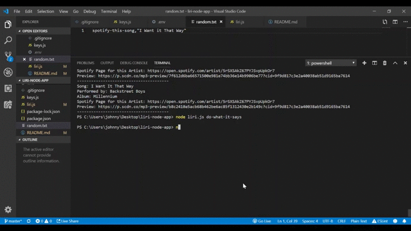
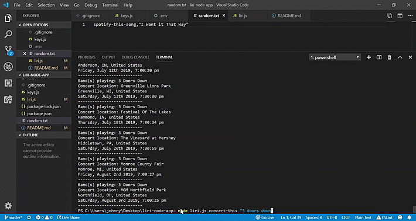
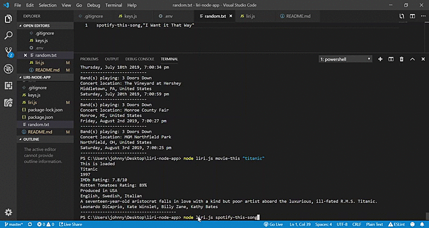

# liri-node-app
#### Week 10: LIRI Search Bot

An easy to use CLI search tool for finding your favorite songs on Spotify, looking for upcoming concerts for bands that play your favorite songs, or even learning more about movies that you have/want to see! Written in Node.js

Node Packages used: Node Spotify API, Axios, Dotenv, Moment

*Updates*: 
* Search queries no longer have to be contained within quotes
* all search results are now appended to a log.txt file, as well as being displayed in the command line

In the command prompt, type in "node liri.js" then one of the following commands:
* "spotify-this-song 'song name'": Search for the top ten tracks off the Spotify API that match that name
* "concert-this 'band name'": Find the most recent concerts around the world headlining your favorite bands
* "movie-this 'movie name'": Get some trivia about movies you want to learn more about. Not too wordy!
* "do-what-it-says": make a command with a search term as dictated by the random.txt file. If you change what random.txt says, the output changes, too!. Just be sure to keep that file in the right format (no spaces, command followed by comma followed by search term in double quotes(""))

### Look for upcoming concerts with "concert-this" command

### Seek out movies with the command "movie-this"

### Find songs with "spotify-this-song"

### "do-what-it-says" command takes search info and commands from the random.txt file
[Demo4](LIRI-bot-demo-4.gif)